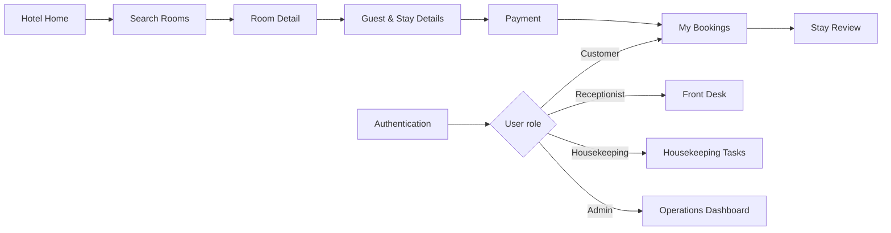

# Diamond Sea Hotel Booking & Operations

<p align="center">
  <strong>A full hotel booking journey for guests, paired with an operations workspace for hotel staff.</strong>
</p>

<p align="center">
  React 19 · TypeScript · Vite · Material UI · TanStack Query · Redux Toolkit · i18next
</p>

Diamond Sea is a personal full-stack hotel management project inspired by a modern beachfront stay in Da Nang. This repository contains the frontend application: a bilingual customer booking experience and a role-aware workspace for reception, housekeeping, and hotel administrators.

The interface is split into two focused design systems: a calm, editorial hospitality experience for guests and a compact, operational interface for hotel staff.

## Contents

- [Highlights](#highlights)
- [Product Areas](#product-areas)
- [Tech Stack](#tech-stack)
- [Application Flow](#application-flow)
- [Project Structure](#project-structure)
- [Getting Started](#getting-started)
- [Available Scripts](#available-scripts)
- [Backend Integration](#backend-integration)
- [Personal Project](#personal-project)

## Highlights

### Guest experience

- Search available room types by check-in, check-out, and guest count.
- Browse room photography, amenities, pricing, capacity, and guest reviews.
- Create bookings with guest details, arrival information, promotion codes, and price quotations.
- Continue through payment creation, checkout-link/QR instructions, and payment status tracking.
- Register, sign in, request a password reset, and set a new password.
- Review personal bookings, reservation details, payment information, and cancellation options.
- Maintain profile information and account security.
- Create and view reviews for completed stays.
- Switch the interface between Vietnamese and English without reloading the page.

### Hotel operations

- Role-aware workspaces for `ADMIN`, `RECEPTIONIST`, and `HOUSEKEEPING` users.
- Operational dashboard with bookings, arrivals, departures, revenue, occupancy, and review summaries.
- Booking management with room selection, quotations, payments, services, housekeeping details, check-in, check-out, and cancellation.
- Room and room-type inventory management, including amenities and image uploads.
- Housekeeping task assignment and status management.
- Weekly staff scheduling with reusable shift definitions.
- Promotion, hotel service, review visibility, and employee account management.
- Separate staff profile and security settings.

## Product Areas

| Area | Main routes | Purpose |
| --- | --- | --- |
| Public hotel | `/`, `/search`, `/room-detail/:id` | Discover the hotel and find suitable rooms |
| Booking | `/booking`, `/payment` | Enter guest details, review pricing, and complete payment |
| Authentication | `/login`, `/register`, `/forgot-password`, `/reset-password` | Customer and staff account access |
| Customer account | `/account/profile`, `/account/bookings`, `/account/reviews` | Manage profile, reservations, and reviews |
| Front desk | `/manager/front-desk`, `/manager/bookings` | Handle daily arrivals, departures, and reservations |
| Hotel operations | `/manager/dashboard`, `/manager/rooms`, `/manager/room-types` | Monitor performance and manage inventory |
| Staff operations | `/manager/housekeeping-tasks`, `/manager/shifts`, `/manager/employees` | Coordinate housekeeping and staff schedules |
| Commercial tools | `/manager/promotions`, `/manager/services`, `/manager/reviews` | Manage offers, services, and guest-review visibility |

Protected routes redirect users to the workspace associated with their role. Unknown public and manager URLs use separate localized Not Found experiences.

## Tech Stack

### Core

- **React 19** and **TypeScript**
- **Vite** with the React SWC plugin
- **React Router** for nested public, customer, and manager routes

### Interface

- **Material UI** and **MUI Icons**
- **MUI X Date Pickers** with **Day.js**
- **Tailwind CSS** for layout utilities
- **Emotion** for MUI styling
- **Framer Motion** for restrained customer-facing motion
- **Recharts** for operational reporting

### Data and application state

- **TanStack React Query** for API state and mutations
- **Redux Toolkit**, **React Redux**, and **Redux Persist** for account/session state
- **Axios** with public and authenticated clients, token refresh, and role-aware redirects
- **i18next** and **react-i18next** for persisted Vietnamese/English localization

### Realtime and media

- **STOMP.js** over **SockJS** for backend notifications/events
- **Cloudinary upload configuration** for hotel imagery

This repository does not contain a database or backend implementation. It consumes a separate REST/WebSocket backend.

## Application Flow



## Project Structure

```text
src/
├── assets/       # Hotel photography and shared images
├── components/   # Shared Client and Admin UI components
├── constant/     # API request/response models and internal constants
├── context/      # Feature-level React context
├── enums/        # Backend-compatible enum types
├── hooks/        # Shared form, authentication, snackbar, and socket hooks
├── i18n/         # i18next setup and VI/EN locale resources
├── layouts/      # Public, customer-account, and manager shells
├── pages/
│   ├── common/   # Public hotel, authentication, booking, and payment pages
│   ├── customer/ # Profile, booking history/details, and reviews
│   └── admin/    # Operations, inventory, staff, and commercial tools
├── routers/      # Nested routes and role-based route guards
├── services/     # Axios service layer grouped by guest/me/staff access
├── store/        # Redux Toolkit store and persisted account state
├── types/        # Shared TypeScript types
└── utils/        # Date, price, role, and formatting helpers
```

## Getting Started

### Prerequisites

- A recent Node.js release with npm
- The companion backend running at `http://localhost:3001`

The frontend currently sends REST requests to `http://localhost:3001/api` and connects to the STOMP/SockJS endpoint at `http://localhost:3001/api/ws`.

### Clone

```bash
git clone https://github.com/akhoa6204/frontend-hotel-management.git
cd frontend-hotel-management
```

### Install dependencies

```bash
npm install
```

### Environment

Create a local `.env` file when image-upload features are required:

```env
VITE_CLOUDINARY_URL_UPLOAD=your_cloudinary_upload_url
VITE_CLOUDINARY_UPLOAD_PRESET=your_unsigned_upload_preset
```

Do not commit real credentials or private upload configuration. All Vite environment variables are bundled into the browser and must be treated as public configuration.

### Development

Start the backend first, then run:

```bash
npm run dev
```

Vite will print the local URL, normally `http://localhost:5173`.

### Production build

```bash
npm run build
```

Preview the generated build locally:

```bash
npm run preview
```

## Available Scripts

| Command | Description |
| --- | --- |
| `npm run dev` | Start the Vite development server |
| `npm run lint` | Run ESLint across the repository |
| `npm run build` | Type-check the application and create a production build |
| `npm run preview` | Serve the production build locally |

## Backend Integration

The service layer is separated by access level:

- `services/guest` — public room, booking, payment, and review endpoints.
- `services/me` — authenticated customer profile, booking, and review endpoints.
- `services/staff` — bookings, rooms, room types, employees, housekeeping, shifts, promotions, services, invoices, payments, reviews, and reporting.

Authentication uses a persisted account state, bearer tokens, Axios interceptors, and a refresh flow. The backend remains the source of truth for permissions, booking status, availability, quotations, and payment verification.

## Personal Project

Diamond Sea is a personal portfolio project focused on combining a polished hotel-booking journey with practical day-to-day hotel operations. The UI, routing, localization, API integration, and role-aware workflows in this repository are implemented as one cohesive frontend application.

---

Built by [Anh Khoa](https://github.com/akhoa6204).
